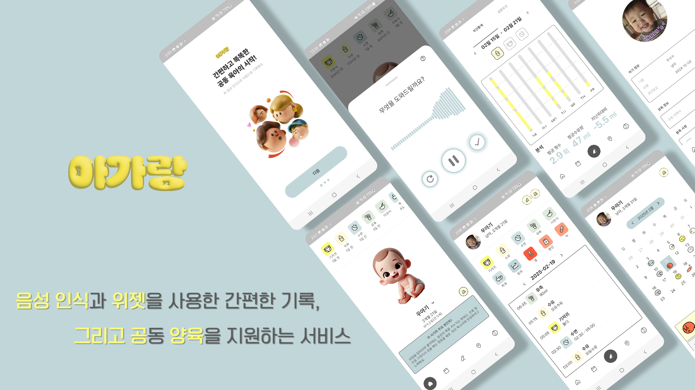
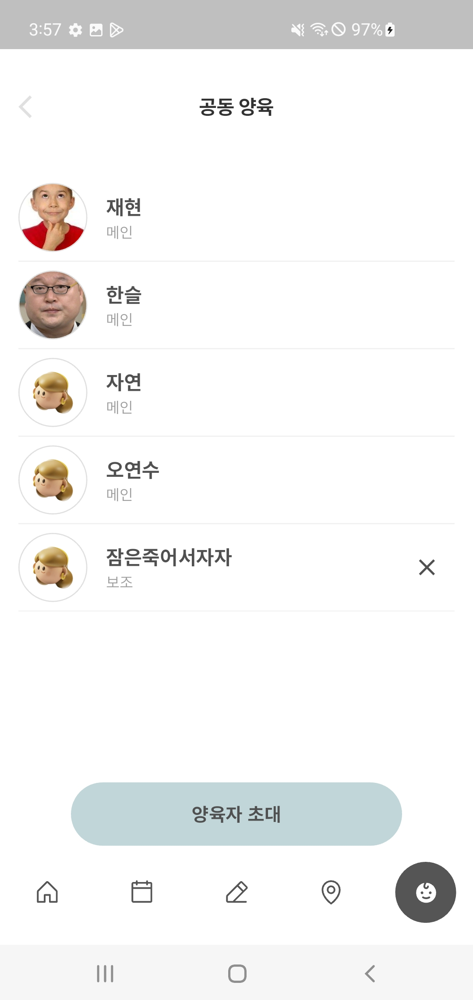
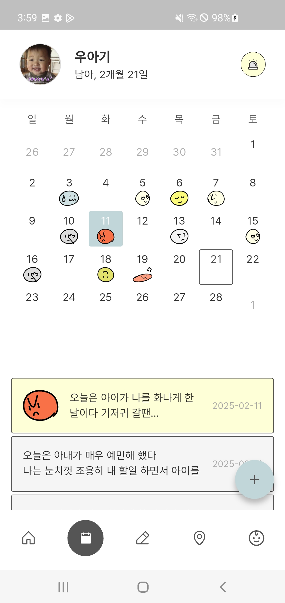
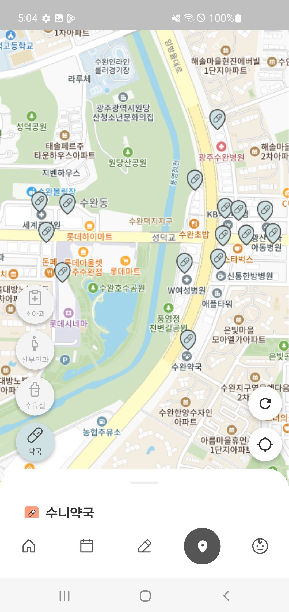
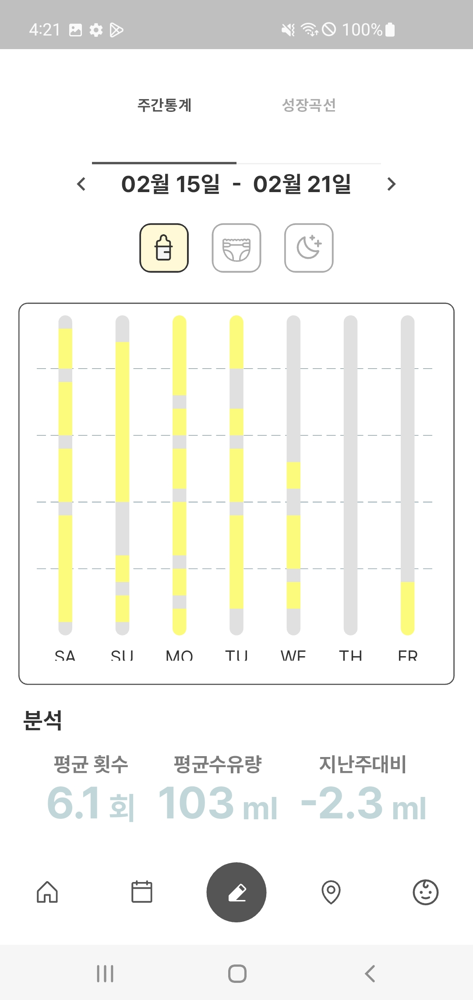
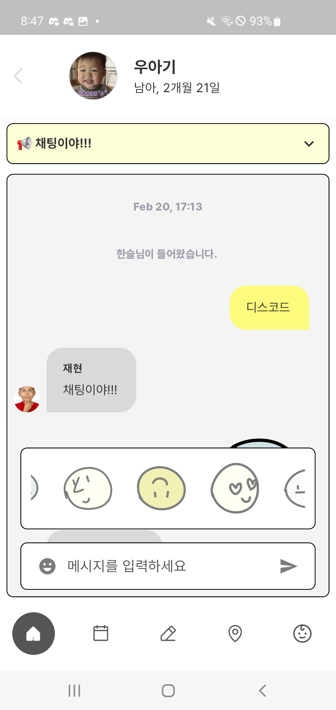

## 아가랑 (Agarang)

간편하고 똑똑한 공동 육아의 시작 육아 어플리케이션

🏆 2025 SSAFY 12기 공통 프로젝트 최우수 수상작

1. [**서비스 소개**](#1)

2. [**기술 스택**](#2)

3. [**주요 기능**](#3)

4. [**부가 기능**](#4)

5. [**프로젝트 구성도**](#5)

6. [**팀원 소개**](#6)

### 1. 📌 서비스 소개

#### ⌚️ 개발기간

` 2025.01.02 ` → `2025.02.20`

#### 🌏 간편하고 똑똑한 공동 육아의 시작 (Agarang)

>아가랑은 육아 기록과 공동 양육을 지원하는 플랫폼입니다. 아기의 배변, 수유, 수면 등 필수 기록을 간편하게 저장하고, AI 음성 인식을 활용해 자동으로 기록할 수 있습니다.
> 공동 양육자를 초대해 아기 정보를 공유하고, 성장 데이터를 시각화하여 패턴 분석 및 맞춤형 인사이트를 제공합니다. 또한, 수유실·병원 위치 정보를 실시간으로 제공하며, 채팅 기능을 통해 공동 양육자가 중요한 정보를 신속하게 공유할 수 있도록 돕습니다.
> 저희 팀 Agarang은 육아 기록 및 공동 양육을 지원하는 어플리케이션 개발을 통해 부모들이 더욱 편리하고 체계적으로 육아를 할 수 있도록 돕는 것을 목표로 합니다.
<!--①②③④⑤⑥⑦⑧⑨⑩-->

### 2. 🛠 기술 스택

<table>
  <tr>
    <td align="center" width="180"><strong>mobile 기술 스택</strong></td>
    <td>
      

          
        
      

    </td>
  </tr>
  <tr>
    <td align="center" width="180"><strong>Back-end 기술 스택</strong></td>
    <td>
        
        
        
         
    </td>
  </tr>
  <tr>
    <td align="center" width="180"><strong>Server 기술 스택</strong></td>
    <td>
        
        
        
        
  </tr>
  <tr>
    <td align="center"><strong>배포</strong></td>
    <td>
      
      </a>
    </td>
  </tr>
<table>

### 3. 🚀 주요기능

<table>
  <thead>
    <tr>
      <th align="center">기능이름</th>
      <th align="center">기능설명</th>
      <th colspan="2" align="center">screenshots</th>
    </tr>
  </thead>
  <tbody>
    <tr>
      <td align="center"><strong>① Record</strong></td>
      <td align="center">
        <strong> <em> 아기 키우면서 이런 저런 기록이 필요한데 간편하고 쉽게 기록 해주는거 없나?</em></strong>  
        Agarang 의 Record는 육아에서 필요한 기록(배변, 수유, 수면, 유축, 이유식, 목욕, 열, 병원, 약)의 기록을 제공합니다. 
        기본 값 자동 설정, 핵심 정보 중심 설계를 하여 번거로움을 고려한 원터치 기록 과 불필요한 뎁스 제거로 정보 구조 단순화 하여 제공해 드립니다. 
        음성 AI를 도입하여 자연스럽게 말을 하면서 자동으로 기록을 할 수 있습니다.
      </td>
      <td></td>
    </tr>
    <tr>
      <td align="center"><strong>② Custody</strong></td>
      <td align="center">
        <strong> <em> 혼자 육아가 아닌 공동 육아를 하도록   공동 육아를 할 수 있게 합니다. </em></strong>  
        공동 육아를 고려하여 주 / 보조 양육자로 권한 구분, 권한을 지정하여 초대, 양육자간 아기 정보 공유가능하게 하도록 초대 코드발급, 공동 양육자 관리 서비스를 제공합니다.
      </td>
      <td></td>
    </tr>
    <tr>
      <td align="center"><strong>③ Diary</strong></td>
      <td align="center">
        <strong> <em> 육아를 하면서 그 날의 전체적인 기록이 필요하지 않을까?   아기에 대한 일기 기능을 제공합니다. </em></strong>  
        첫 걸음마, 첫 이유식 등 아기의 소중한 순간 저장을 할 수 있고 육아 다이어리를 제공합니다.
        AI를 활용한 일기 내용의 키워드 추출, 키워드 기반 검색을 할 수 있습니다. 
      </td>
      <td></td>
    </tr>
    <tr>
      <td align="center"><strong>④ Map</strong></td>
      <td align="center">
        <strong> <em> 육아 하면서 급한 상황이 오는데   해당 장소가 어디에 있을까...? </em></strong>  
        수유실, 병원, 약국, 베리어 프리가 어디에 있는지 사용자의 현재 위치 기반으로 근처 정보 제공을 해줍니다.
        수유실, 병원 목록등을 신속하게 확인할수 있습니다. 아빠도 이용 가능한 가족 수유실 정보 제공을 합니다.
      </td>
      <td></td>
    </tr>
<tr>
      <td align="center"><strong>⑤ Statistics </strong></td>
      <td align="center">
        <strong> <em> 내 아이가 얼마나 변화, 성장 되었는지   또래 아이들의 평균 성장 변화랑 비교해보고 싶어 </em></strong>  
        우리 아이의 주간 평균 성장 변화 추이 제공해주고 수유량 / 수면 시간등 패턴 분석으로 우리 아이 생활 리듬 파악하게 도와줍니다. 
        성장 지표 그래프로 시각화와 맞춤형 인사이트를 제공해줍니다.
      </td>
      <td></td>
    </tr>
    <tr>
      <td align="center"><strong>⑥ PIYONG</strong></td>
      <td align="center">
        <strong> <em> 내가 아닌 다른 사람이 육아 할때    어떤 문제가 있었는지 바로바로 알고 싶어!! </em></strong>  
        공동 양육자가 육아를 하고 있을때 전에 있었던 이슈를 공동 양육자한테 물어볼 수 있게 채팅 기능을 제공합니다. 채팅에서 중요한 메세지는 공지로 등록할 수 있고 이 공지가 등록되면 다른 양육자한테 알림을 보낼수 있도록 합니다.
      </td>
      <td></td>
    </tr>
  </tbody>
</table>

<!--①②③④⑤⑥⑦⑧⑨⑩-->

 

### 👩‍💻 팀원소개

|         [정재현](https://github.com/hyeonjaez)          |                                   [유한슬]()                                    |                                    [권해림]()                                    |                     [이지은]()                      |                                    [오연수]()                                    |                                    [김자연]()                                    |
|:----------------------------------------------------:|:----------------------------------------------------------------------------:|:-----------------------------------------------------------------------------:|:----------------------------------------------------------------------------:|:-----------------------------------------------------------------------------:|:-----------------------------------:|
|                    Lead, BACKEND                     |                               Android, Design                                |                                    Android                                    |                                     Android                                    |                                    BACKEND                                    |               BACKEND               |

